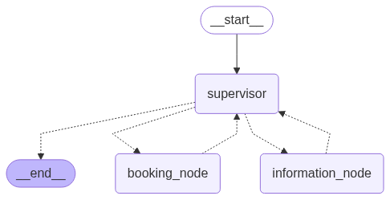

### AI-Powered Hospital Agent System

This project is an AI agent-based hospital assistant designed to streamline interactions such as doctor appointment booking, cancellations, rescheduling, and answering hospital-related FAQs. It consists of a **supervisor agent** that intelligently routes user queries to the appropriate sub-agent for execution.

---

### Architecture Overview

The system is built with three main agents:

1. **Supervisor Agent**
   - Acts as a central controller.
   - Interprets user queries and delegates them to the relevant specialized agent.
   
2. **Booking Agent**
   - Handles all tasks related to appointment **booking**, **cancellation**, and **rescheduling**.

3. **Information Agent**
   - Responds to **FAQs** and queries about **doctor availability**.

---

### Current Data Source.

- The agents currently use a **CSV file** as the primary database for doctor information and appointment records.
- Work is in progress to **transition to a SQL-based backend** to allow SQL agents to handle queries with better performance, scalability, and reliability.

---

### Agent Flowchart.

---

### Things that I'm currently working on:

- Replace CSV storage with a **relational SQL database**.
- Introduce **authentication and user-specific sessions**.
- Integrate **LLM-powered fallback reasoning** for complex user queries.
- Add **email and WhatsApp notifications** for appointment confirmations and reminders.

---

### Tech Stack:

- **Language:** Python.
- **LLM Frameworks:** LangChain | Langgraph.
- **Data Source:** CSV (transitioning to MySQL or PostgreSQL).
- **Frontend:** Streamlit.
- **Backend API (planned):** FastAPI.
